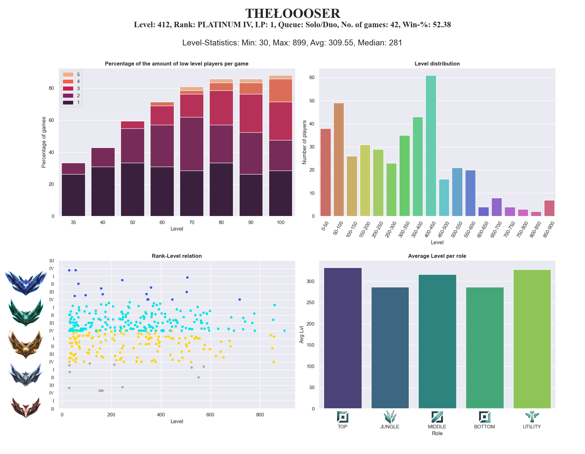

# Statistics about low level players in your Solo/Duo Games


With the start of the 13<sup>th</sup> ranked League of Legends season and therefore also the removal of Smurf Q 
([Source](https://tearofthegoddess.com/lol-news/riot-is-fixing-ranked-by-removing-smurf-q/)), there seemed to be 
noticeably more low level players in Solo/Duo queue. How many exactly? How many per game? How does the level 
distribution look like? Is there a relation between level and rank? Are those low level players all smurfs? These are 
all questions that can be answered with the code in this repository.


## Getting started

### Prerequisites
- [Riot API key](https://developer.riotgames.com/)
- Python 3
- Packages
    - numpy, pandas
    - seaborn, matplotlib
    - argparse, requests, tqdm, dotenv

### Installation

Clone this repository
```
git clone https://github.com/TheLoooser/LowLevelStats.git
```

Download and unzip the ranked emblem and position images from [here](https://developer.riotgames.com/docs/lol) and put
them under the `images` folder.  
Create a `.env` file under the root folder of this repository and place your api key in there.
```
KEY='Your-API-key-goes-here'
```

The folder structure should then look as follows (the data folder will be created automatically):
```
. LowLevelStats
├── data                    # The match and summoner data
├── images                  # Lol specific images
  └── ranked-emblem         
  └── ranked-position      
├── results                 # Output folder
├── source                  # All scripts
├── .env                    # API key
├── .gitignore               
├── main.py                 # The main script
└── README.md               # This file
```

### Executing the program
Run the main script and pass the summoner name of the player you are interested in as argument. E.g.
```
python main.py TheŁoooser
```

## Results

